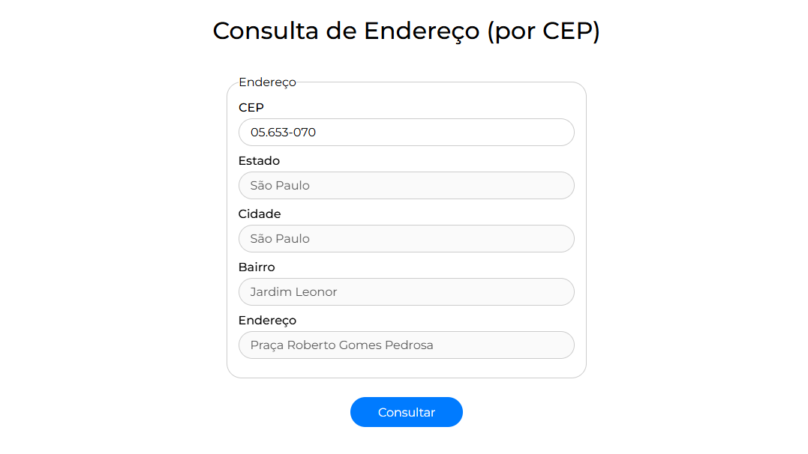

# Consulta de Endereço (por CEP)

Consulta de endereços em todo o Brasil com base no CEP informado, utlizando uma interface fluida e intuitiva.

**Autor:** Efraim Costa

---

## 📸 Screenshot

## 🚀 Características Principais

- **Consumo da API [ViaCEP](https://viacep.com.br/)** para verificar endereços em todo o Brasil com base no CEP digitado
- **Máscara de Input com Regex** no campo de CEP, a fim de garantir a formatação adequada (XX.XXX-XXX)
- **Interface Dinâmica e Animada**, melhorando a experiência do usuário (UX)

## ⚙️ Como Executar

1. Clone o repositório
2. Abra o arquivo `index.html`
3. Digite um CEP e clique em "Consultar"

---